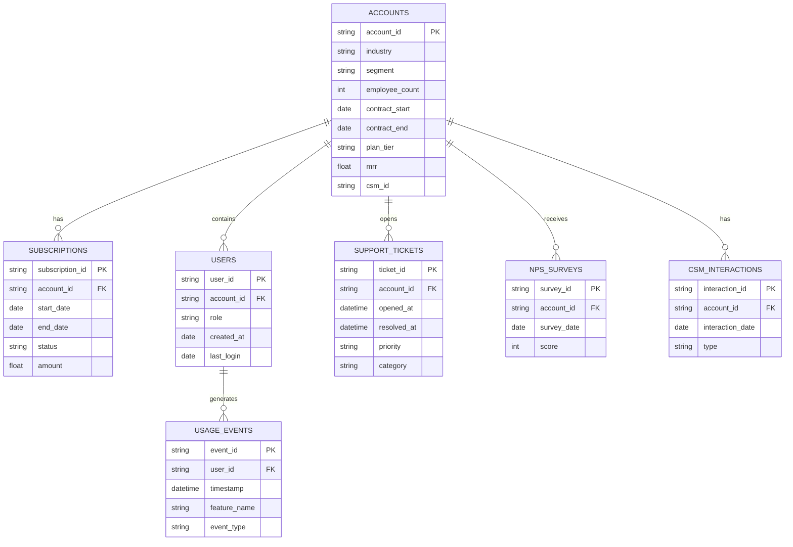

# Customer Health Score & Churn Driver Analysis

> A predictive analytics project for B2B SaaS Customer Success teams.
> Author: Oscar — MSc Business Analytics candidate, Industrial Engineer.

---

## 1. Problem Statement

En empresas SaaS B2B de tamaño medio (500–2,000 cuentas activas, ticket size medio-alto), el equipo de Customer Success opera bajo una tensión estructural: cada CSM (Customer Success Manager) gestiona entre 60 y 120 cuentas, pero sin priorización basada en data. El resultado es un modelo **reactivo**: el CSM descubre que una cuenta está en riesgo cuando el cliente envía un cancel request, cuando llega un ticket escalado, o peor, cuando el contrato ya venció sin renovación.

Este proyecto construye un **Customer Health Score** predictivo y su capa explicativa de **churn drivers**, con el objetivo de convertir al equipo de CS de reactivo a proactivo.

El stakeholder simulado es un **Head of Customer Success** que necesita responder cada lunes:

> *"¿En qué 20 cuentas debe enfocarse mi equipo esta semana, y qué acción concreta debe tomar en cada una?"*

---

## 2. Why this matters (business case)

En SaaS B2B, las métricas que mueven valuation son **Net Revenue Retention (NRR)** y **Gross Revenue Retention (GRR)**. NRR > 110% es el benchmark de SaaS públicas best-in-class. Por cada punto porcentual de mejora en retention, el impacto compuesto sobre ARR a 5 años es no-lineal.

**Costos típicos del problema:**

- Adquirir un cliente B2B cuesta **5–7x** más que retener uno existente (CAC vs retention cost).
- Un cliente enterprise perdido equivale a **3–5 años de LTV** no recuperable.
- Sin sistema de scoring, los CSMs distribuyen su tiempo sub-óptimamente: cuentas "ruidosas" (que reclaman mucho pero pagan) reciben atención innecesaria; cuentas "silenciosas en declive" pasan desapercibidas hasta que es tarde.

Un health score con precision/recall balanceado a 90 días permite reasignar hasta **40%** del tiempo del equipo CS hacia cuentas donde la intervención cambia el resultado.

---

## 3. Scope & assumptions

### In scope

- Simulación de una empresa SaaS B2B ficticia — *Acme Analytics Cloud* — con 18 meses de historia operacional.
- ~800 cuentas con mix realista de segmentos (SMB, Mid-Market, Enterprise), industrias, y planes.
- Predicción de churn a horizonte de **90 días**.
- Modelo interpretable (regresión logística regularizada + análisis de coeficientes) priorizado sobre black-box.
- Dashboard operacional para consumo directo del equipo CS.

### Out of scope (decisiones explícitas)

- **NLP sobre contenido de tickets:** agregaría complejidad sin ROI para V1.
- **Deep learning:** sacrifica interpretability, que es el activo más valioso para el stakeholder (CSM).
- **Real-time scoring:** batch semanal es suficiente para el operational cadence de CS.
- **Revenue forecasting:** proyecto adyacente, fuera del alcance de éste.

### Assumptions clave

- **Definición operativa de churn:** cancelación activa dentro de la ventana de 90 días, *o* falta de renovación dentro de 30 días post-contract-end.
- **Ventana de observación para features:** 90 días previos al punto de predicción.
- **Data generada sintéticamente** con distribuciones calibradas a benchmarks públicos de SaaS (churn rates por segmento, NPS distribution, support ticket volume por ACV).

---

## 4. Data model

El warehouse simulado sigue un modelo en estrella con seis tablas principales. Este diseño refleja cómo luce un data warehouse real (Snowflake, BigQuery, Redshift) de una empresa SaaS: no es un CSV plano, es intencional — parte del skill que se demuestra es saber modelar y hacer joins, no consumir data pre-procesada.

---

## 5. Business questions

El análisis debe responder, con evidencia cuantitativa:

1. **Leading indicators** — ¿Qué combinación de señales observables con 90 días de anticipación predice churn mejor que azar? Baseline: churn rate del portafolio completo.
2. **Risk segmentation** — ¿El perfil de churn es homogéneo o difiere por segmento (SMB vs Enterprise), industria, o plan tier? Modelo único vs modelos segmentados.
3. **Product engagement vs relationship health** — ¿Predice mejor el comportamiento en-producto (logins, feature adoption, DAU/WAU ratio) o las señales relacionales (NPS, ticket volume, CSM touchpoints)?
4. **CSM bandwidth realista** — Dado el recall del modelo, ¿cuántas cuentas flagged puede atender un CSM por semana sin degradar la calidad de intervención? ¿Dónde cortar el threshold?
5. **Marginal feature impact & accionabilidad** — De las top features predictivas, ¿cuáles son *accionables* por un CSM y cuáles son solo descriptivas? (`industry=retail` no es accionable; `no logins en 21 días` sí lo es.)
6. **Early warning window** — ¿A cuántos días de anticipación el modelo empieza a detectar señal confiable? Un score que solo avisa 15 días antes es inútil operacionalmente.

---

## 6. Success metrics

### Métricas técnicas del modelo

| Métrica | Objetivo | Justificación |
|---|---|---|
| Recall (clase positiva) | ≥ 0.70 | Costo de outreach innecesario << costo de cliente perdido. |
| Precision | ≥ 0.40 | Con churn base ~8–12%, esto representa lift de 4–5x sobre random. |
| AUC-ROC | ≥ 0.80 | Sanity check de separabilidad. |
| Calibración | Brier score bajo | Una probabilidad de 75% debe significar ~75% en la realidad. |

### Métricas de utilidad del proyecto

- ¿Un CSM puede leer el output y saber qué hacer sin ayuda de un analista? **(interpretability test)**
- ¿El dashboard responde las 6 business questions sin necesidad de abrir el notebook?
- ¿Un reclutador técnico puede reproducir el proyecto completo desde el README en menos de 30 minutos?

---

## 7. Deliverables

El repositorio final contiene:

- `README.md` — narrativa de negocio de cara al reclutador. Las instrucciones técnicas viven en `docs/`.
- `docs/project-brief.md` — este documento.
- `docs/methodology.md` — decisiones técnicas y sus justificaciones.
- `data/` — scripts de generación sintética + sample outputs.
- `sql/` — DDL del schema + queries de feature engineering.
- `notebooks/` — EDA, modeling, validation (numerados y en orden).
- `src/` — pipeline reproducible, no notebooks sueltos.
- `dashboard/` — archivo Power BI + screenshots.
- `linkedin-post.md` — draft del post de launch.

---

## 8. Findings & recommendations

*A completar al cierre del proyecto.*

---

*Stack: Python (pandas, scikit-learn, Faker, numpy), SQL (SQLite/PostgreSQL), Power BI, Git/GitHub.*